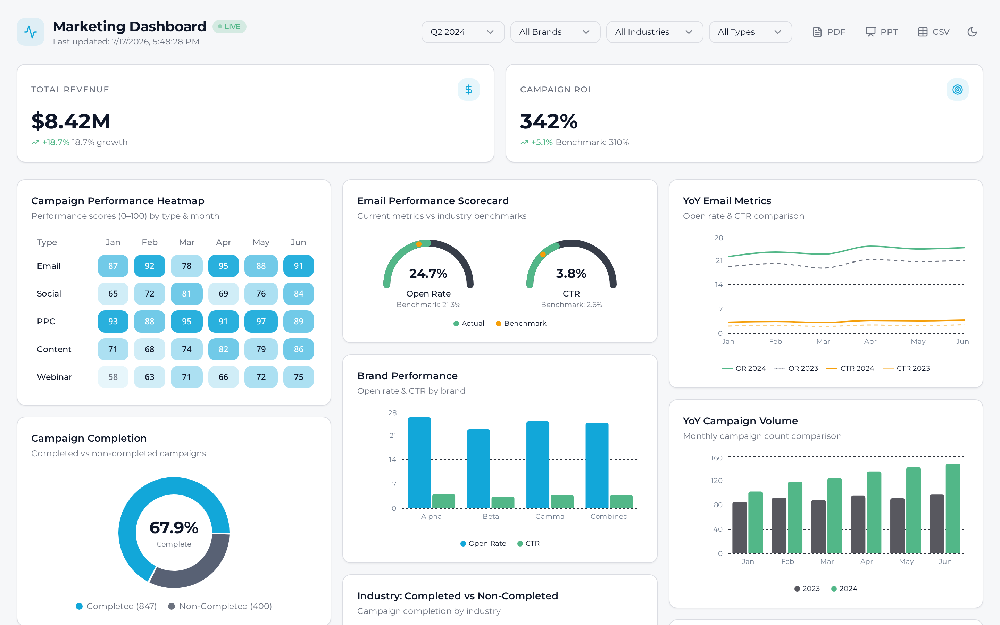

# Marketing Performance Dashboard

A data-driven marketing analytics dashboard built with React and TypeScript. Visualizes campaign performance, KPIs, engagement heatmaps, and AI-generated insights across brands and industries.

**Repository:** [github.com/laurenmajid-ops/PerformanceMarketing](https://github.com/laurenmajid-ops/PerformanceMarketing)



## Features

- **KPI cards** — Total Revenue, ROI, Active Subscribers, and Emails Sent
- **Performance heatmap** — engagement by day and hour
- **Campaign completion** — donut chart with active-campaign progress
- **Product ROI bubble chart** — spend vs. conversion rate with drill-down
- **Email metrics** — Open Rate / CTR gauges plus brand and industry breakdowns
- **Trend analysis** — YoY revenue and lead trends with an auto-scrolling ticker
- **Deep-dive analytics** — AI insights, theme word cloud, anomaly alerts, and benchmark gaps
- **Light / dark mode** toggle

## Tech Stack

- React 18 + TypeScript
- Vite 5
- Tailwind CSS + shadcn/ui
- Recharts for data visualization
- Framer Motion for animation

## Getting Started

```bash
git clone https://github.com/laurenmajid-ops/PerformanceMarketing.git
cd PerformanceMarketing
npm install
npm run dev
```

The app runs at `http://localhost:8080`.

## Build

```bash
npm run build
npm run preview
```

## Data

All values are mocked in [`src/data/mockData.ts`](./src/data/mockData.ts). Swap this module for a live API to wire it to real data.

## License

MIT — see [LICENSE](./LICENSE).
